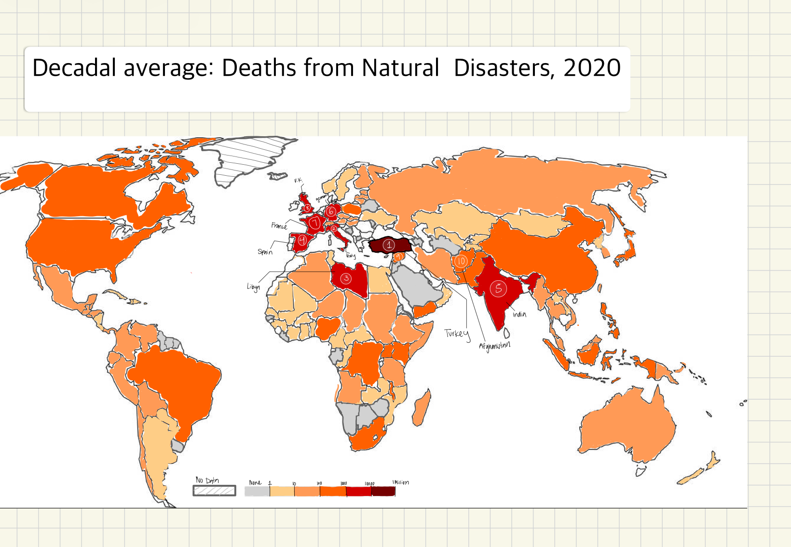

| [home page](https://cmustudent.github.io/tswd-portfolio-templates/) | [visualizing debt](visualizing-government-debt) | [critique by design](critique-by-design) | [final project I](final-project-part-one) | [final project II](final-project-part-two) | [final project III](final-project-part-three) |

# Makeover Monday Activity 
Text here...

_For each step below, you should document your progress as you move forward.  In terms of tone, think of the writeup as though you're keeping journal of your step-by-step process.   You should include a any insights you gained from the critique method, and what it led you to think about when considering the redesign.  You should talk about how you moved next to the sketches, and any insights you gleaned from your user feedback.  Document what you changed based on the user feedback in your redesign.  Finally, talk about what your redesigned data visualization shows, why you selected the data visualization you did, and what you attempted to show or do differently._

_You can include screenshots, sketches or other artifacts with your narrative to help tell the story of how you moved through the process.  Again, make sure to avoid including any personally identifying information about your interviewees (don't list full names, etc.).  While this template serves as a guide, make sure to reference the assignment writeup on Canvas for the official guidance.  This template does not include all guidance mentioned on the assignment page._

## Step one: Choosing Visualization to Makeover 

Data Visualization: 
Natural Disasters
How many people die from disasters, and how are these impacts changing over time?
https://ourworldindata.org/natural-disasters

Include paragraph or two on why you selected this particular data visualization.  For obvious reasons, the data visualization you select should come from a publicly accessible source._

## Step two: Critiquing the Visualization 
_Don't forget to complete the Google Form found on the assignment page.  You can summarize your thoughts here._

## Step three: Sketch the Makeover

## Step four: Test the Makeover

**Feedback #1: **
Can you describe to me what this is telling you?
The map represents deaths caused by natural disasters. 

Is there anything you find surprising or confusing?
The countries being listed 1 - 10 could be confusing in terms of if 1 is the highest death or the lowest among the top 10. 

Is there anything you would change or do differently?
What are the natural disasters that happened in these countries. Is there really no deaths from natual disasters in those regions. The map is overall clear, it is straight forward with the darkest color being highest death. Did have questions about the difference between determining a polygon is gray with line and just a solid grey color. Listing countries in a chart to the side of the map. 

**Feedback #2: **
Can you tell me what you think this is? Can you describe to me what this is telling you?
It's a map of natural disasters as of 2020. 

Is there anything you find surprising or confusing?
The decadal average term is confusing. 

Is there anything you would change or do differently?
Make 1-10 numbered countries clear. The gradient color is good. The legend number is clear and cleaner that way so leave it as is. 

Synthesis: 

_What patterns in the feedback emerge?  What did you learn from the feedback?  Based on this feedback, come up with what design changes you think might make the most sense in your final redesign._

Both individuals that provided feedback were curious to know what sort of natural disasters were driving the total number of deaths in each country. Turkey had the highest natural disasters. Feedback provider #1 asked, "what goes on in Turkey?". The authors of this dataset on the impact of natural disasters on countries around the world probably gathered this information to help government officials be prepared for natural disasters. A map with total deaths from natural disasters is too general for a government to form an actionable plan from the visual. Given this curiosity in what natural disasters are causing deaths in a nation I will instead focus on a region of the world and choose a natural disaster that impacts that region the most. This way I can provid more detailed information for a smaller region than provding less information for a larger region. 

## Step five: Build the Makeover

_Include and describe your final solution here. It's also a good idea to summarize your thoughts on the process overall. When you're done with the assignment, this page should all the items mentioned in the assignment page on Canvas(a link or screenshot of the original data visualization, documentation explaining your process, a summary of your wireframes and user feedback, your final, redesigned data visualization, etc.)._

<noscript></noscript><object class='tableauViz'  style='display:none;'><param name='host_url' value='https%3A%2F%2Fpublic.tableau.com%2F' /> <param name='embed_code_version' value='3' /> <param name='site_root' value='' /><param name='name' value='NaturalDisasters-LineChart&#47;EffectsofFloodLineChart' /><param name='tabs' value='no' /><param name='toolbar' value='yes' /><param name='static_image' value='https:&#47;&#47;public.tableau.com&#47;static&#47;images&#47;Na&#47;NaturalDisasters-LineChart&#47;EffectsofFloodLineChart&#47;1.png' /> <param name='animate_transition' value='yes' /><param name='display_static_image' value='yes' /><param name='display_spinner' value='yes' /><param name='display_overlay' value='yes' /><param name='display_count' value='yes' /><param name='language' value='en-US' /><param name='filter' value='publish=yes' /></object>
                

