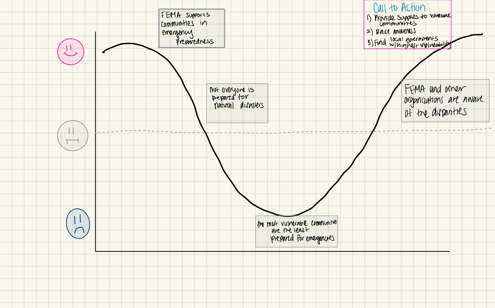
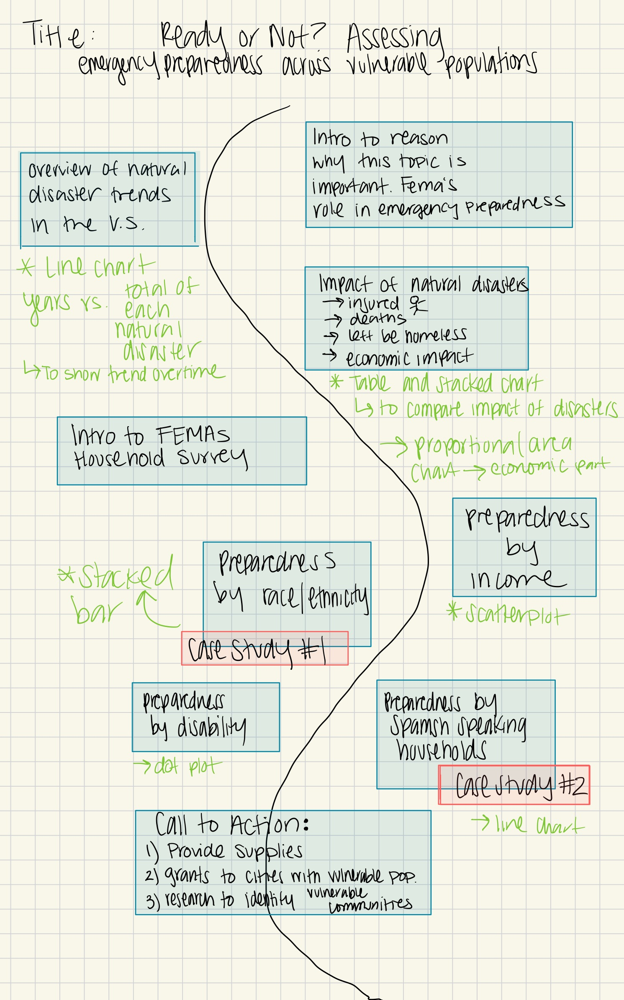
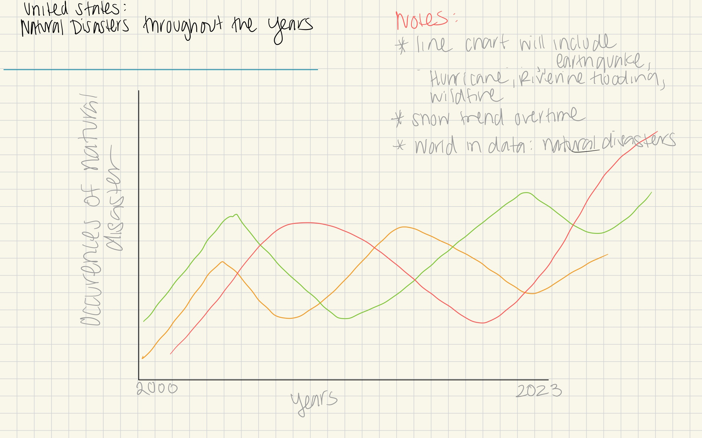
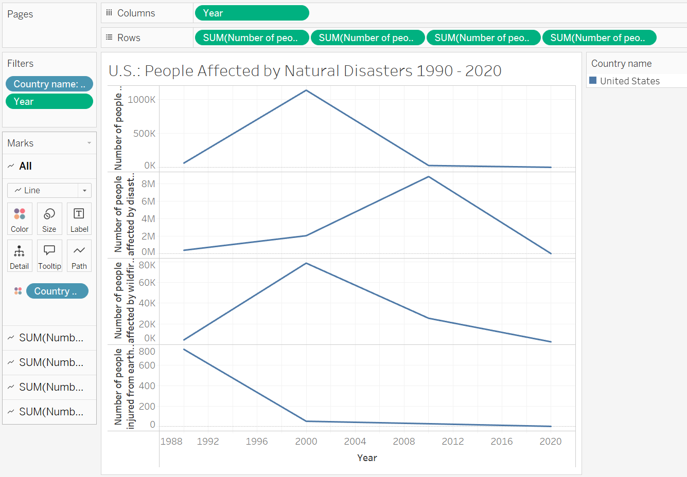
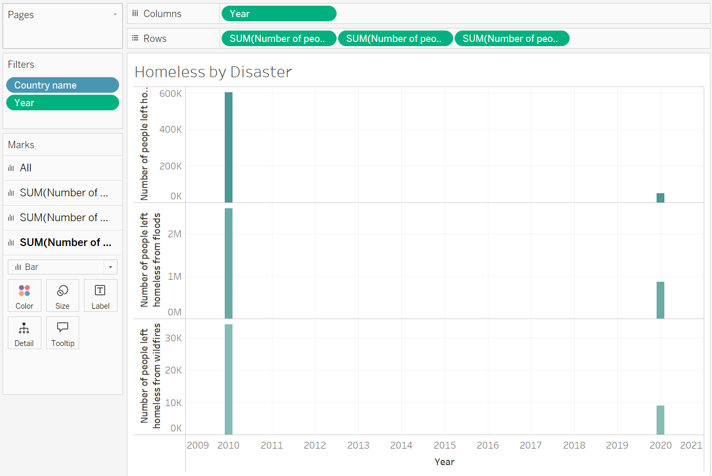

| [home page](https://lauraxxsantos.github.io/Portfolio_LauraSantos/) | [visualizing debt](visualizing-government-debt) | [critique by design](critique-by-design) | [final project I](final-project-part-one) | [final project II](final-project-part-two) | [final project III](final-project-part-three) |

# Outline
In this project I will conduct a research analysis on emergency preparedness in the United States. Our World in Data site showed that natural disasters are increasing (Ritchie, 2022). It is vital that people across all communities, especially the most vulnerable are prepared for a disaster. In my project, I will share information on emergency preparedness across households with a disability status, low-income households, and households whose main language is spanish. 

Research Objective: Assess disparities in emergency preparedness across vulnerable populations. Identify points of interventions to increase emergency preparedness. 

Project Goals: 
- Flag disparities in emergency preparedness that exist among communities to advocate for campaigns that approach emergency preparedness with a culturally-senstive and socioeconomic lens. Different communities may require a different approach. 

- Raise awareness about community levels of natural disaster preparedness to push for government interventions that increase safety for all U.S. residents. 

- Determine which natural disasters communities are less aware about ways to prepare or less prepared for. 

## Initial sketches

Below are drafts of tablaeu charts. 
*Please note: I am still learning how to navigate Tablaeu so these are very much a draft draft. I plan to display data using chart types that best fit the purpose behing each data visualization.

Sketch 1: A line chart to show the trend of disasteres over decades.  

Sketch 2: A multi-line chart to be able to compare affected people by natural disaster.

Sketch 3: 
A stacked chart to visualize how each natural disaster makes up homelessness amount. 

# The data
 
Our World in Data: 
Natural Disasters
https://ourworldindata.org/natural-disasters
- This data set will be used to provide an overview of natural disasters in the United States over the last four decades 90s to 2020s.I will create a visual to show how each natural diaster has trended overtime
- This dataset provides information on deaths by natural disaster. A map on fatalities will be included. 
- The dataset also provides information on the number of people affected and inurey by disaster. A chart will also be created on that. 

FEMA:
National Household Survey 2023
https://www.fema.gov/about/openfema/data-sets/national-household-survey 
- This is a survey dataset that provides information on how well households are prepared for a disaster. It has information for coastal flooding, riverine flooding, earthquake, hurricane, wildfires, and radiological emergencies. 
- The dataset includes demographic data for each household. For my research project I will create visuals that compare preparedness across household disability status, main household language, income, and race/ethnicity. 

Census Data: 
American Community Survey 5-Year Data (2009-2022) 
https://www.census.gov/data/developers/data-sets/acs-5year.html 
- I am going to overlap census tract income averages with locations of natural disasters. 
- Depending on other findings in the data I will pull other ACS 5-year estimate data to provide a further analysis on emergency preparedness

# Method and medium
The data analysis of this project will be completed using R, GIS, Tableau, and possibly online visualization tools. The story will be told using the shorthand platform. In the presentation you will see varying charts and maps when appropriate. 
