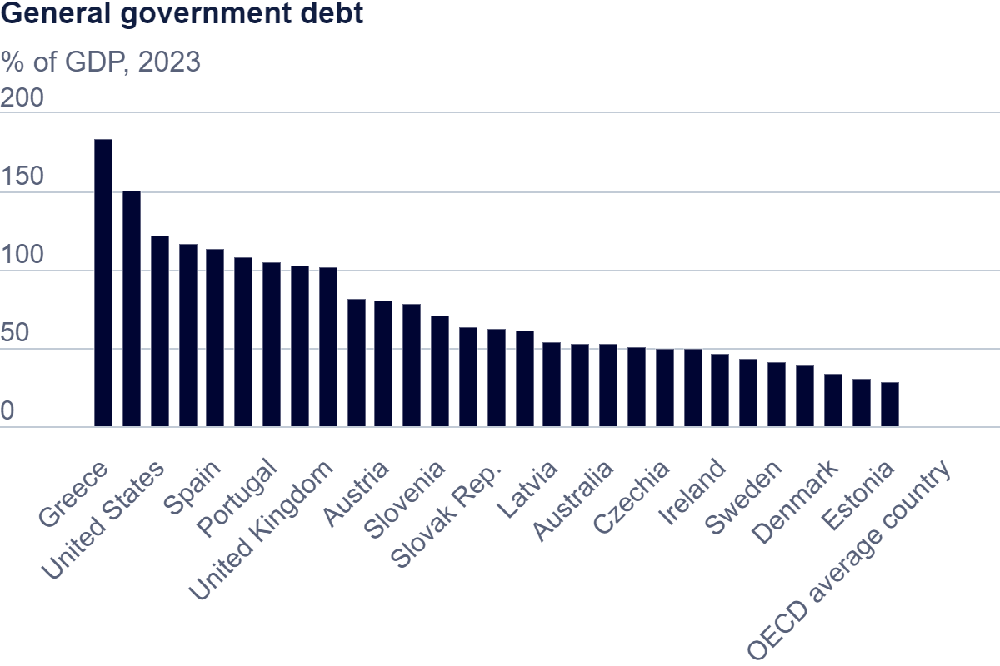
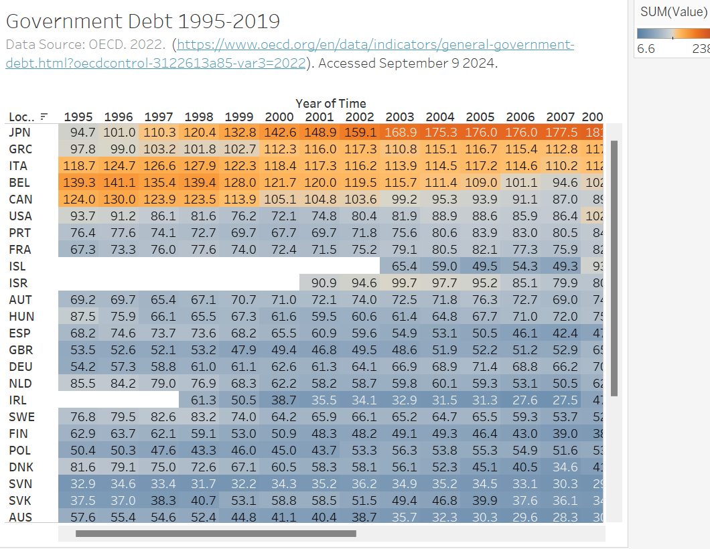
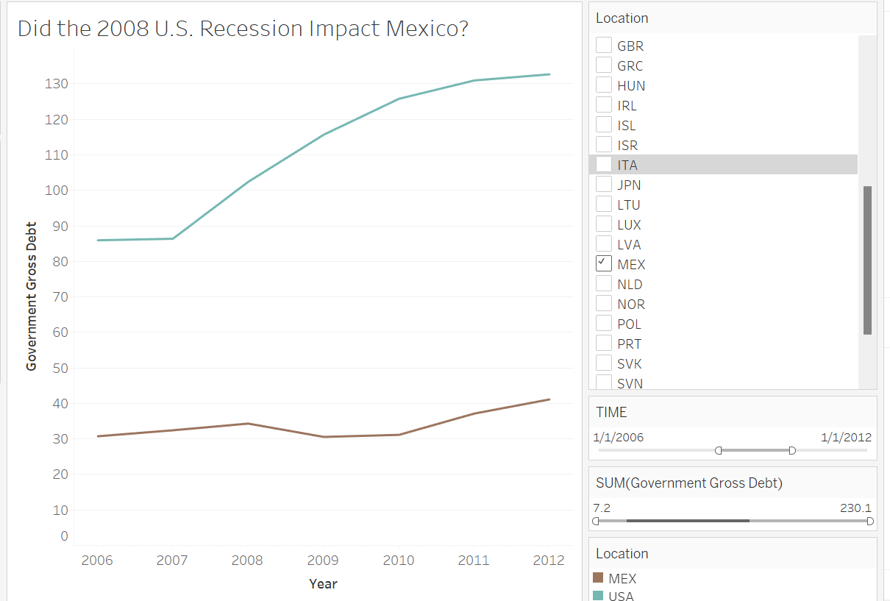

| [home page](https://cmustudent.github.io/tswd-portfolio-templates/) | [visualizing debt](visualizing-government-debt) | [critique by design](critique-by-design) | [final project I](final-project-part-one) | [final project II](final-project-part-two) | [final project III](final-project-part-three) |

# Visualizing Government Debt 

## Part one: Working with web-based visualization tools and data

## Working with Tableau

## Part three: create your own visualization

Did the 2008 U.S. Recession impact Mexico? 

U.S. and Mexico economies are tied together. Family members working in the U.S. send remittances to their loved ones in Mexico. 
In this visualziation I tried to assess the impact of the 2008 reccession in the U.S. to the government debt in Mexico. 
This visualization is a line, which is very distinct from the visual above. With only comparing two countries, the visual I chose was simple but told the story. I chose only two colors in comparison to the above that has a gradient color. The visual above spans 10+ years while my visual focuses on the time frame around the recession. I made sure to only include the data that was relevant. 

_It's a good idea to go back and review your work.  Could someone follow your process and understand what you did?  Do you need to further connect any of the sections with a bit of text?  Is it something you'd be happy to have as an example of your work from the class?_

